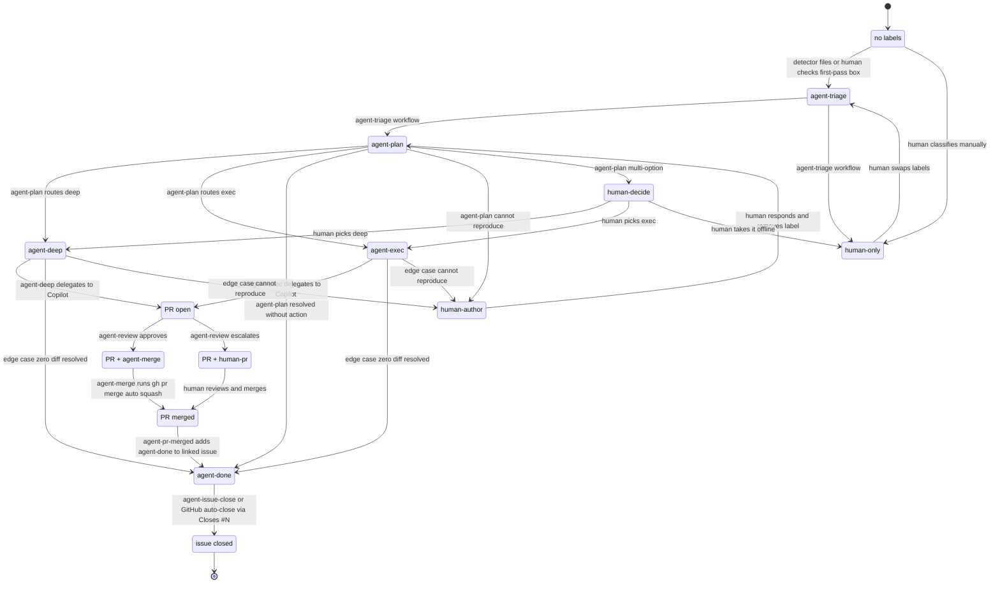

# Agent triage — state machine

Canonical reference for the issue → agent → PR state machine that runs across the Nowline OSS repos (`lolay/nowline`, `lolay/nowline-action`). This file is the OSS source-of-truth; the commercial mirror lives at `lolay/nowline-infra/.github/AGENT_TRIAGE.md`. The two docs are allowed to diverge over time; commercial may add repo-specific labels later.

The flow turns any GitHub issue with the right starting label into a series of small AI-driven phases: **triage** decides whether the agent should proceed; **plan** decides what to do; **implement** (deep or fast) writes the code; **review** decides whether the PR is safe to auto-merge. Empty PRs are forbidden by design. Humans can override or stop the flow at any step by swapping a label.

This file is for humans and agents alike — agents read it as part of their phase prompts (the prelude tells them to). When in doubt, the file you're reading is the authoritative source for *what* the flow does; the workflow files in [`.github/workflows/`](./workflows/) are the authoritative source for *how*.

## State machine

Issues start with no labels, get `agent-triage` from a detector or the issue-template checkbox, and walk forward through the phases until the issue closes (`agent-done`) or pauses on a human (`human-only`, `human-author`, `human-decide`, `human-pr`).



## Label naming convention

Two prefixes, both kebab-case, no colons:

- **`agent-…`** — the agent owns the next move. The label name matches the workflow file that fires on it (e.g. `agent-plan` triggers [`.github/workflows/agent-plan.md`](./workflows/agent-plan.md)). One-to-one mapping.
- **`human-…`** — a human owns the next move. The flow is paused.

Origin/metadata labels (`cursor-engine-sync`, `dependencies`, `bug`, `automated`, `copilot-pr`) are not state labels; they're preserved through every transition. Renovate's `dependencies` label is one of these. `copilot-pr` is stamped on every PR authored by Copilot's coding-agent identity and persists for the life of the PR.

## Label lifecycle — replace, don't accumulate

State labels are mutually exclusive. At any moment an issue carries exactly one state label (or zero, before triage); a PR carries exactly one (`agent-merge` or `human-pr`) or zero pre-review.

Two glue workflows enforce the lifecycle together:

- [`.github/workflows/agent-verdict-apply.yml`](./workflows/agent-verdict-apply.yml) — the only sanctioned path for an agent (gh-aw phase orchestrator or Copilot session) to add a state label. It reads a verdict marker from a comment, validates the proposed transition against the state machine, and refuses to apply an `agent-*` verdict when any `human-*` label is present. Phase workflow frontmatter has no `safe-outputs.add-labels` capability.
- [`.github/workflows/agent-label-transition.yml`](./workflows/agent-label-transition.yml) — refined cleanup. When a `human-*` label is added (by a human or by verdict-apply), strips all other state labels (humans win unconditionally). When an `agent-*` label is added (by verdict-apply after its override check passed), strips prior `agent-*` labels only and leaves `human-*` labels intact as defence-in-depth.

Why this design:

- **Glance-readable state.** `gh issue list --label agent-plan` returns exactly the issues currently being planned, not the historical set.
- **Self-healing human transitions.** A human swapping `human-decide` for `agent-deep` only needs to add `agent-deep`; cleanup removes `human-decide` automatically.
- **Audit trail intact.** GitHub's timeline records every label add/remove, so the full lineage is recoverable from `gh api repos/lolay/nowline/issues/<n>/timeline` even though the current label set only shows the current state.

## Label glossary

| Label | Where | Added by | Means | Next move |
| --- | --- | --- | --- | --- |
| `agent-triage` | issues | detector workflow, issue template checkbox, or human | "triage me" | `agent-triage.md` runs |
| `agent-plan` | issues | `agent-triage.md` (or human via override) | triage approved | `agent-plan.md` runs |
| `agent-deep` | issues | `agent-plan.md` (or human via override) | plan routed to deep implement (Opus) | `agent-deep.md` runs |
| `agent-exec` | issues | `agent-plan.md` (or human via override) | plan routed to fast implement (Sonnet) | `agent-exec.md` runs |
| `agent-merge` | PRs | `agent-review.md` | review approved | `agent-merge.yml` runs `gh pr merge --auto --squash` |
| `agent-done` | issues | `agent-plan.md`, implement-phase fallback, or `agent-pr-merged.yml` | terminal — work resolved | `agent-issue-close.yml` closes the issue (no-op if GitHub already auto-closed via `Closes #N`) |
| `human-only` | issues | `agent-triage.md` (or human via opt-out) | agent excluded permanently | none — human swaps labels to resume |
| `human-author` | issues | `agent-plan.md`, implement-phase fallback | agent waiting on filer | filer responds, removes label, plan re-fires |
| `human-decide` | issues | `agent-plan.md`, implement-phase fallback (no plan) | agent waiting on human pick | human adds `agent-deep` / `agent-exec` / `human-only` |
| `human-pr` | PRs | `agent-review.md` | PR needs human review | human reviews and merges (or closes) |

## Human-override paths

Any state can be redirected by a human via label transitions. The cleanup glue workflow handles the housekeeping; the human just adds the new state label.

| From | To | How |
| --- | --- | --- |
| `human-only` | `agent-triage` | add `agent-triage`; cleanup removes `human-only`; triage re-fires |
| `human-author` | `agent-plan` | post a clarifying comment, then add `agent-plan`; cleanup removes `human-author`; plan re-fires |
| `human-decide` | `agent-deep` or `agent-exec` | add the chosen routing label; cleanup removes `human-decide`; the matching implement workflow fires |
| `human-decide` | `human-only` | add `human-only`; flow stops |
| `human-pr` | manual merge | human reviews and clicks merge in the GitHub UI |
| any state | `human-only` | add `human-only` to abort the flow at any phase |

The `agent-pr-merged.yml` and `agent-issue-close.yml` glue workflows are the only path to `agent-done` — humans don't need to add it manually, and shouldn't.

## Empty-PR ban with three-way resolution

The state machine forbids PRs with zero diff. (See commit `8463631` for the failure mode this design replaces.) When a phase determines no work is needed, it posts a verdict comment:

| Why no PR | Verdict marker | Resulting label | Effect | Comment expectation |
| --- | --- | --- | --- | --- |
| **Resolved without action** — already implemented, duplicate, wrong repo, detector-says-no-action | `agent-verdict: agent-done` | `agent-done` | `agent-issue-close.yml` closes the issue | one-line reason + link to existing implementation / duplicate |
| **Cannot reproduce / ambiguous** | `agent-verdict: human-author` | `human-author` | issue stays open, awaits filer | `## What I tried` + `## What I need from you` |
| **Multi-option / hard-rule blocks action** | `agent-verdict: human-decide` | `human-decide` | issue stays open, awaits human pick | numbered options with trade-offs and a recommendation |

The verdict marker is the literal plain-text line `agent-verdict: <label>` (no backticks, no HTML comment, no code fence) and must be the **first non-blank line** of the comment body. `agent-verdict-apply.yml` reads it, validates the transition against the state machine, and applies the label. The plain-text form is required because gh-aw's safe-outputs content sanitizer transforms XML/HTML-comment syntax into a custom self-closing-tag form (T6 Markdown Safety in the [Safe Outputs Specification](https://github.github.com/gh-aw/reference/safe-outputs-specification/)) that the parser cannot match.

Both `agent-plan.md` and the implement workflows (`agent-deep.md`, `agent-exec.md`) can emit any of these terminals; plan is expected to catch most cases, and the implement-phase fallback is the last-line defence if Copilot finds zero diff at the end. **For Copilot coding-agent sessions**: when the diff is empty after attempting the plan, post a comment with the appropriate verdict marker instead of opening a zero-diff PR or calling `gh issue edit --add-label` directly. `agent-verdict-apply.yml` is author-agnostic — Copilot's comment flows through the same mechanism as gh-aw orchestrator verdicts.

`agent-review.md` has its own defensive empty-PR check: if a PR somehow lands with an empty diff, it emits `human-pr` with a comment recommending the PR be closed.

## Workflows

| File | Type | Trigger | Side effects |
| --- | --- | --- | --- |
| [`.github/workflows/agent-triage.md`](./workflows/agent-triage.md) | gh-aw | `issues.labeled` for `agent-triage` | add label `agent-plan` or `human-only` + comment |
| [`.github/workflows/agent-plan.md`](./workflows/agent-plan.md) | gh-aw | `issues.labeled` for `agent-plan` | add label `agent-deep` / `agent-exec` / `agent-done` / `human-author` / `human-decide` + comment |
| [`.github/workflows/agent-deep.md`](./workflows/agent-deep.md) | gh-aw | `issues.labeled` for `agent-deep` | assign-to-agent (Opus) + fallback labels |
| [`.github/workflows/agent-exec.md`](./workflows/agent-exec.md) | gh-aw | `issues.labeled` for `agent-exec` | assign-to-agent (Sonnet) + fallback labels |
| [`.github/workflows/agent-review.md`](./workflows/agent-review.md) | gh-aw | `pull_request.opened`/`synchronize` for `copilot-pr`-labeled PRs | add label `agent-merge` or `human-pr` + comment |
| [`.github/workflows/agent-merge.yml`](./workflows/agent-merge.yml) | plain | `pull_request.labeled` for `agent-merge` | defensive ruleset check, then `gh pr merge --auto --squash`; if no required CI is configured on `main`, falls back to `human-pr` with an explanatory comment |
| [`.github/workflows/agent-pr-merged.yml`](./workflows/agent-pr-merged.yml) | plain | `pull_request.closed && merged` for `copilot-pr`-labeled PRs | parse `Closes #N`, add `agent-done` to issue |
| [`.github/workflows/agent-verdict-apply.yml`](./workflows/agent-verdict-apply.yml) | plain | `issue_comment.created` on issues + PRs | parse verdict marker from comment; check state-machine allowed-list + `human-*` override; apply proposed state label via `GH_AW_AGENT_TOKEN` so downstream phase fires |
| [`.github/workflows/copilot-pr-stamp.yml`](./workflows/copilot-pr-stamp.yml) | plain | `pull_request.opened` by Copilot identity | add `copilot-pr` metadata label; the only place in the estate that checks bot identity |
| [`.github/workflows/copilot-pr-validate.yml`](./workflows/copilot-pr-validate.yml) | plain | `pull_request.labeled` for `copilot-pr` + `synchronize`/`ready_for_review` | close PR + relabel linked issue to `human-author` if any of the 3 contract checks fail (non-empty diff, `Closes #N`, `Assisted-by:` in body) |
| [`.github/workflows/agent-issue-close.yml`](./workflows/agent-issue-close.yml) | plain | `issues.labeled` for `agent-done`, gated by `state == 'open'` | `gh issue close $ISSUE` |
| [`.github/workflows/agent-label-transition.yml`](./workflows/agent-label-transition.yml) | plain | any `agent-…` / `human-…` label add | remove all other state labels from target |
| [`.github/workflows/agent-aw-update.yml`](./workflows/agent-aw-update.yml) | plain | weekly cron | `gh aw update --all`, open PR if upstream changed |
| [`.github/workflows/shared/agentic-prelude.md`](./workflows/shared/agentic-prelude.md) | gh-aw shared | imported by phase workflows | the shared rules every phase respects |

## Install-and-update propagation

`gh-aw` workflows live as a `.md` source file plus a `.lock.yml` compiled artifact. The OSS source-of-truth is this repo (`lolay/nowline`); its `.github/workflows/agent-*.md` files are the canonical. `lolay/nowline-action` doesn't run any agent workflows — it's a publish-only repo with a redirect `AGENTS.md` pointing back at `lolay/nowline`.

`agent-aw-update.yml` runs weekly. It executes `gh aw update --all`, which checks each installed workflow's `source:` pin against upstream and produces a three-way merge if upstream changed. If the merge produces a non-empty diff, the workflow opens a PR titled `chore(aw): sync agentic workflows from upstream`. The PR's diff is reviewable like any other.

This repo self-consumes its own workflows — no `gh aw add` is needed because the source-of-truth IS the working repo. The same is true for `lolay/nowline-infra` on the commercial side.

## Rollout phase (allowlist mode)

For the first ~2 weeks after deployment:

- The `agent-triage.md` workflow's `if:` condition skips unless the label was added by a known detector (e.g. `cursor-engine-sync.yml`) or by the issue template's "Let an AI agent take a first pass" checkbox.
- Manually-filed issues without the checkbox don't enter the flow even if a label exists.

After ~10 issues have run cleanly through all four phases, the allowlist condition is removed and the flow becomes the default for any issue with `agent-triage`. `human-only` remains as the opt-out.

## Empty-PR ban — extended notes

The empty-PR ban is enforced at three layers:

1. **Prompt discipline.** `agent-plan.md`'s decision tree forces the planner to pick a terminal before routing to implement. Cases (a)/(b)/(c) cover the no-work-needed scenarios explicitly.
2. **Implement-phase fallback.** `agent-deep.md` and `agent-exec.md` instruct the delegated Copilot session to post a verdict-marker comment (`agent-verdict: agent-done` or `agent-verdict: human-author`) instead of opening a zero-diff PR. `agent-verdict-apply.yml` picks up the verdict and applies the label.
3. **Review-phase defensive check.** `agent-review.md` flags any zero-diff PR that somehow slipped through and routes it to `human-pr` with a recommendation to close.

Together these prevent the failure mode where a detector files an issue, the agent opens a PR with no actual diff, and CI auto-merges nothing into main.

## One-time repo-settings checklist

The settings below were applied to all six repos on 2026-05-24; this list is for posterity and onboarding-a-new-repo cases.

- **Branch ruleset on `main`** with `required_approving_review_count: 0`, `bypass_mode: always` for OrgAdmin + the release App, `required_status_checks` populated with the repo's CI contexts. Spec: [`ops/branch-policies.md`](../ops/branch-policies.md). The auto-merge flow demands zero required reviewers and CI as the only gate.
- **Repo settings**: `allow_auto_merge: true`, `allow_squash_merge: true`, `delete_branch_on_merge: true`. Without these, `gh pr merge --auto` errors.
- **Secrets** (three per repo):
  - `GH_AW_AGENT_TOKEN` — gh-aw magic-name fine-grained PAT for `safe-outputs: assign-to-agent` (assigning Copilot to issues/PRs). Needs Repo permissions `actions/contents/issues/pull-requests: Write`.
  - `GH_AW_GITHUB_TOKEN` — gh-aw magic-name fine-grained PAT used by all other `safe-outputs:` operations (label adds, comments). Same permissions as `GH_AW_AGENT_TOKEN`; **same PAT value works under both names**. This token must NOT be `GITHUB_TOKEN` because GitHub's loop-prevention design suppresses downstream-workflow triggering on `GITHUB_TOKEN`-driven events; without `GH_AW_GITHUB_TOKEN` installed, the safe-output label adds succeed but the next phase's workflow never fires.
  - `COPILOT_GITHUB_TOKEN` — gh-aw's Copilot CLI engine auth. Must be a **user-account-owned PAT** with Account permission `Copilot Requests: Read`. Structurally a different shape from the two repo-permission PATs above; not interchangeable.
- **Org-level Copilot**: cloud agent enabled, Anthropic Claude partner agent on, repository access set to All repositories at the `lolay` org level. New repos in the org inherit access automatically; gating is enforced by which repos have agent workflows installed (and by `nowline-action`'s redirect `AGENTS.md` for the publish-only repo).
- **Issue templates**: `bug_report.yml` and `feature_request.yml` include a "Let an AI agent take a first pass" checkbox that auto-applies `agent-triage`.

## Audit trail recovery

The current label set on an issue or PR shows the current state but elides history (because cleanup removes prior state labels). To recover the full lineage:

```bash
gh api repos/lolay/nowline/issues/<n>/timeline --paginate \
    --jq '.[] | select(.event == "labeled" or .event == "unlabeled") | {event, label: .label.name, actor: .actor.login, created_at}'
```

Every label add and remove event is durable in the timeline. Every comment that an `agent-*` workflow posts is durable in the issue body. Together they reconstruct what the agent saw, what it decided, and when. Searches like `is:closed label:agent-done` find every issue that resolved through the flow regardless of which terminal path it took.

## Troubleshooting

- **Issue stuck on `agent-plan` for >30 minutes.** The plan phase uses Opus and can take a few minutes, but >30m suggests the workflow failed to start. Check `gh run list --workflow=agent-plan.md --limit 5` for the run. If it's missing, the trigger condition probably didn't match — verify the issue carries `agent-plan` and no skip-gate label.
- **Plan re-fires repeatedly.** Plan re-fires whenever its trigger label is re-added. If a human keeps swapping `human-author` → `agent-plan` without responding to the questions in the comment, the plan will keep producing the same `human-author` output. The right move: respond to the questions in a comment, *then* swap the label.
- **PR has `agent-merge` but isn't auto-merging.** Either (a) `agent-merge.yml`'s defensive guard found no required CI on the ruleset and fell back to `human-pr` (look for a comment from the bot explaining), or (b) one or more required checks is failing. Check the PR's Checks tab. The defensive guard exists because three commercial repos currently lack required CI contexts; the OSS repo (`lolay/nowline`) has nine and passes through cleanly.
- **Issue closed but `agent-done` not present.** GitHub's `Closes #N` auto-close fires before `agent-pr-merged.yml` can add the label, depending on race ordering. In that case `agent-pr-merged.yml` adds `agent-done` post-close; the `agent-issue-close.yml` workflow is a no-op when the issue is already closed. Both terminals are reachable; search by `is:closed label:agent-done` for the canonical query.
- **Two phase workflows ran on the same issue back-to-back.** Expected if a human added two labels in quick succession or if a workflow re-fired. The cleanup workflow ensures the state label set ends as a singleton; intermediate phases that ran before the wrong label was removed are harmless (they're judgment-only — no PR was opened from them).
- **Copilot session opened a PR but `agent-review.md` didn't fire.** First check whether `copilot-pr-stamp.yml` ran: `gh run list --workflow=copilot-pr-stamp.yml --limit 5`. If stamp didn't run, the PR author wasn't a recognised Copilot identity — update the `if:` in `.github/workflows/copilot-pr-stamp.yml` to include the new identity literal (the only place the check lives). If stamp ran and the `copilot-pr` label is present on the PR, check `gh run list --workflow=agent-review.md --limit 5` — the review workflow's `if:` is `contains(labels, 'copilot-pr')`, so the label being present should be sufficient. Also check the `bots:` list in `agent-review.md` — it's retained as defense-in-depth; if gh-aw's pre-activation gate rejects the PR, add the new bot identity there too.
- **PR was auto-closed by `copilot-pr-validate.yml`.** The validate workflow enforces three checks on every `copilot-pr`-labeled PR: (1) non-empty diff — if Copilot opened a zero-diff PR, the implementation phase should have emitted `agent-done` or `human-author` instead; re-add the correct label to the issue and close the PR manually if needed; (2) `Closes #N` in the PR body — add the missing reference and `gh pr reopen <PR>` to re-trigger validation; (3) `Assisted-by: <model>` in the PR body's `## AI assistance` section — add the missing line and reopen. After fixing the PR body, push a new commit or reopen the PR to trigger the `synchronize`/`ready_for_review` re-validation run.
- **Verdict suppressed by human override.** An `agent-verdict: agent-*` comment was posted but the issue (or PR) already carries a `human-*` label applied by a human moderator to take the work offline. `agent-verdict-apply.yml` detects the override and posts a follow-up comment naming the offending label. To resume the agent flow, a human removes the `human-*` label and adds the desired `agent-*` label (or re-adds `agent-triage` to restart from Phase 1). The cleanup workflow's refined behaviour (don't strip `human-*` when adding `agent-*`) is the belt-and-suspenders here.
- **Verdict rejected: not allowed from current state.** The proposed verdict isn't in the allowed-list for the issue/PR's current state. Examples: `agent-verdict: agent-merge` posted on an issue (PR-only verdict), or `agent-verdict: agent-plan` posted on an issue already labeled `agent-deep`. The state-machine case statement in `agent-verdict-apply.yml` is the canonical encoding; check it against the state diagram above. To recover, post a new comment with a valid verdict for the current state, or transition manually via label-swap.
- **Verdict silently dropped (marker mangled).** If your agent emits the marker but `agent-verdict-apply.yml` logs `No verdict marker on first non-blank line; treating as regular comment` and never posts a follow-up, the marker likely got transformed by gh-aw's safe-outputs content sanitizer. The marker must be the literal plain-text line `agent-verdict: <label>` — no backticks, no HTML comment, no code fence. Check the rendered comment body on the issue/PR (not the agent's intended output) to see what landed.

## FAQ

**Why split implement into two phases (`agent-deep` and `agent-exec`)?** gh-aw's `model:` is static frontmatter — you can't pick a model at runtime based on a routing label. The split lets the plan phase choose Opus (deep, thorough) for genuinely tricky changes and Sonnet (fast, cheaper) for mechanical work. The two implement workflows differ only in their model and their trigger label.

**Why is judgment ≠ implementation?** The structural guarantee from `safe-outputs:` is the design's foundation: judgment phases physically cannot open PRs or modify code. Even if a prompt confuses the model into "wanting" to write code, the workflow's permissions don't allow it. Same is true for the review phase — it can label and comment, period.

**Why does `agent-merge.yml` have a defensive guard?** Because not every repo in this estate has required CI contexts wired into its ruleset yet. Without the guard, `gh pr merge --auto` would land an ungated PR on those repos. The guard checks for at least one `required_status_checks` context before calling auto-merge; if none, it relabels to `human-pr` with an explanatory comment. See `commercial-three-pr-ci-gates` in the rollout plan and [nowline-infra/ops/branch-policies.md](../../nowline-infra/ops/branch-policies.md) §6 for the gap.

**Why preserve origin labels (`cursor-engine-sync`, `dependencies`, etc.)?** They're metadata about *where the issue came from*, not state. The cleanup workflow only touches `agent-…` and `human-…` labels. This means `is:closed label:cursor-engine-sync label:agent-done` shows every issue the engine-sync detector filed that resolved through the agent flow — useful for tracking detector signal-to-noise.
