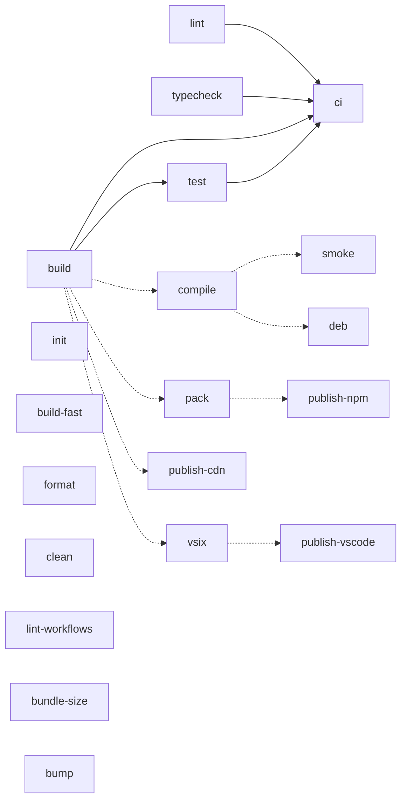

# Makefile Reference

The [`Makefile`](./Makefile) is the single source of truth for this repo's
build / test / lint / package / publish command strings. Humans, local agents,
cloud agents, and CI all run the same verbs — the GitHub Actions workflows call
`make <target>`, so a green `make ci` locally runs the same gate CI runs.

`make help` is the fast terminal lookup; this file is the narrative reference.

## Target Dependencies



Solid arrows are hard prerequisites — running a target automatically runs
everything to its left (`make ci` runs `lint`, `typecheck`, `build`, `test`;
`make test` runs `build` first). Dotted arrows mark a softer relationship: the
target consumes another's output (e.g. `publish-npm` publishes the tarballs
`pack` produces) but does not hard-depend on it, because in the release
pipeline that artifact is built in a separate CI job and handed over — see
[Why `publish-*` don't hard-depend on `build`](#why-publish-dont-hard-depend-on-build).

## Targets

### Develop

| Target | Description |
|--------|-------------|
| `help` | List targets, grouped (the default goal) |
| `init` | Install workspace dependencies from the frozen lockfile (`pnpm install --frozen-lockfile`) |
| `build` | Build every package and render `examples/` + `tests/` to SVG (`pnpm build`) |
| `build-fast` | Build every package but skip the ~30-SVG render — the inner dev loop (`NOWLINE_SKIP_RENDER=1 pnpm build`) |
| `lint` | Static check: biome lint + format-drift + import organization, no writes (`pnpm check`) |
| `format` | Auto-fix formatting, lint, and import order (`pnpm check:fix`) |
| `typecheck` | Type-check the packages that opt in (`pnpm typecheck`) |
| `test` | Run every package's Vitest suite (`pnpm -r test`); depends on `build` |
| `ci` | The full pre-push gate: `lint` + `typecheck` + `build` + `test` |
| `clean` | Remove build / binary / package artifacts (keeps `node_modules`) |
| `lint-workflows` | actionlint the GitHub Actions workflows (`pnpm lint:workflows`) |
| `bundle-size` | Build the embed dependency graph and run the CDN bundle-size + `node:*` leak gate |

### Release

| Target | Description |
|--------|-------------|
| `compile` | Compile standalone CLI binaries (`TARGET=bun-<os>-<arch>` or `local`; omit for all). Needs Bun and a prior `build`. |
| `smoke` | Smoke-test a compiled binary across every export format (host-derived, or `MATRIX_*` from CI) |
| `deb` | Build a `.deb` wrapping the compiled binary (`ARCH=amd64\|arm64`) |
| `pack` | Pack the publishable `@nowline/*` npm tarballs into `dist-pack/` (dependency order) |
| `vsix` | Package the VS Code / Cursor extension into a `.vsix` |
| `bump` | Bump every package version (`LEVEL=patch\|minor\|major`); prints the new version |

### Danger

Remote-mutating targets. Each refuses to run unless its action-specific
`CONFIRM_*` variable is set, and prints what it would touch + how to proceed.
CI sets the variable inline in the release / deploy workflow; a human or agent
running it by hand hits the friction. Excluded from `make ci`.

| Target | Guard | Description |
|--------|-------|-------------|
| `publish-npm` | `CONFIRM_PUBLISH` | Publish the `@nowline/*` tarballs in `dist-pack/` to npmjs.com |
| `publish-vscode` | `CONFIRM_PUBLISH` | Publish the extension to the VS Code Marketplace + Open VSX (`VSIX=` path) |
| `publish-cdn` | `CONFIRM_DEPLOY` | Deploy the `@nowline/embed` bundle to the Firebase Hosting CDN (`PROJECT_ID=`, `FIREBASE_PROJECT_PATH=`) |

Example: `make publish-npm` prints

```
Refusing to run "make publish-npm": Publishes @nowline/* to npmjs.com
This pushes to a remote. Re-run with CONFIRM_PUBLISH=1 (CI sets this in the release/deploy workflow).
```

The guard protects the sanctioned path (`make publish-*`); a raw `npm publish`
still works, so it complements rather than replaces npm-native guards. It is the
friction for the command people and agents actually reach for.

### Why `publish-*` don't hard-depend on `build`

The standard convention chains heavier targets onto lighter gates so they can't
be skipped (`ci: lint typecheck build test`, `test: build`). The guarded
`publish-*` targets are the one deliberate exception in this repo: nowline's
release pipeline builds artifacts **once** in [`build.yml`](./.github/workflows/build.yml)
and hands them to a separate, pure-push publish/deploy job
([`release.yml`](./.github/workflows/release.yml),
[`embed-cdn.yml`](./.github/workflows/embed-cdn.yml)) that has no build
toolchain installed. A hard `build` prerequisite would make those CI steps fail
(and re-running the whole build on a publish runner defeats the artifact
handoff). Instead each guarded target asserts its prebuilt input exists
(`dist-pack/*.tgz`, the `.vsix`, the CDN `public/` tree) and fails loudly if
not — preserving the "never ship an unbuilt artifact" guarantee for a manual
run while keeping CI's job separation intact. For a clean local publish, run the
producing target first (`make build pack` then `CONFIRM_PUBLISH=1 make publish-npm`).

## GitHub Actions

YAML owns orchestration (triggers, concurrency, permissions, toolchain setup +
caching, the OS/Node matrix, WIF auth, artifact upload, PR comments); the
Makefile owns the command strings. Each gate step is `run: make <target>`, which
keeps per-step logs and the matrix while sourcing the command from one place.

| Workflow | Trigger | What it does | make targets |
|----------|---------|--------------|--------------|
| [`ci.yml`](./.github/workflows/ci.yml) | push to `main`, pull requests | Lint workflows; build + lint + typecheck + test across the OS/Node matrix; embed bundle-size gate; release-build smoke (calls `build.yml`) | `lint-workflows`, `build`, `lint`, `typecheck`, `test`, `bundle-size` |
| [`build.yml`](./.github/workflows/build.yml) | reusable (called by `ci.yml` smoke + `release.yml`) | 10-cell build/package matrix: compile per-OS/arch binaries, smoke them, build `.deb`s, pack npm tarballs, package the `.vsix`, stage the action mirror + embed CDN bundle | `compile`, `smoke`, `deb`, `pack`, `vsix` |
| [`release.yml`](./.github/workflows/release.yml) | `v*` tag push, manual dispatch | Cut release (bump + tag), call `build.yml` with upload, publish to npm + Marketplace + Open VSX, GitHub release + Homebrew tap + action mirror, deploy prod embed CDN | `bump`, `publish-npm`, `publish-vscode` (guarded with `CONFIRM_PUBLISH=1`) |
| [`embed-cdn.yml`](./.github/workflows/embed-cdn.yml) | push to `main`, pull requests, manual dispatch | Build the dev IIFE; continuous-deploy `embed.nowline.dev`; per-PR ephemeral preview channel | `publish-cdn` (guarded with `CONFIRM_DEPLOY=1`, embed-dev job) |

Other workflows (`copilot-pr-*`, `agent-*`, `editor-release-monitor.yml`,
`vscode-extension-engine-bump.yml`, the generated `agent-*.lock.yml`) run
label/issue/PR plumbing or agent-runtime setup, not product build/test/deploy
commands, so they call no make target. The Makefile is the source of truth:
change a command there, not in the workflow.
