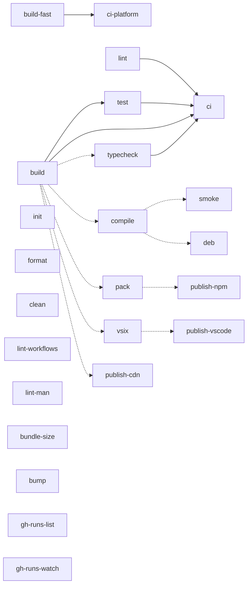

# Makefile Reference

The [`Makefile`](./Makefile) is the single source of truth for this repo's
build / test / lint / package / publish command strings. Humans, local agents,
cloud agents, and CI all run the same verbs — the GitHub Actions workflows call
`make <target>`, so a green `make ci` locally runs the same gate CI runs.

`make help` is the fast terminal lookup; this file is the narrative reference.

## Target Dependencies


```mermaid
graph LR
    %% solid = hard prerequisite (make runs the left target first)
    build --> test
    lint --> ci
    build --> ci
    typecheck --> ci
    test --> ci
    build_fast["build-fast"] --> ci_platform["ci-platform"]

    %% dotted = consumes the left target's output but is not a hard make
    %% prerequisite: typecheck is ordered after build inside ci instead, and
    %% the release artifacts come from a separate CI job (see "Why publish-*
    %% don't hard-depend on build" below)
    build -.-> typecheck
    build -.-> compile
    compile -.-> smoke
    compile -.-> deb
    build -.-> pack
    build -.-> vsix
    pack -.-> publish_npm["publish-npm"]
    vsix -.-> publish_vscode["publish-vscode"]
    build -.-> publish_cdn["publish-cdn"]

    %% standalone
    init
    format
    clean
    lint_workflows["lint-workflows"]
    lint_man["lint-man"]
    bundle_size["bundle-size"]
    bump
    gh_runs_list["gh-runs-list"]
    gh_runs_watch["gh-runs-watch"]
```

Solid arrows are hard prerequisites — running a target automatically runs
everything to its left (`make ci` runs `lint`, `build`, `typecheck`, `test`,
in that order; `make test` runs `build` first; `make ci-platform` runs
`build-fast` first and never reaches `build`). Dotted arrows mark a softer
relationship: the target consumes another's output but does not hard-depend on
it. `typecheck` reads sibling packages' built `dist/` types, so `ci` orders it
after `build` rather than making every standalone `make typecheck` rebuild.
`publish-npm` publishes the tarballs `pack` produces, but in the release
pipeline that artifact is built in a separate CI job and handed over — see
[Why `publish-*` don't hard-depend on `build`](#why-publish-dont-hard-depend-on-build).

## Targets

### Develop

| Target | Description |
|--------|-------------|
| `help` | List targets, grouped (the default goal) |
| `init` | Install workspace dependencies from the frozen lockfile (`pnpm install --frozen-lockfile`) |
| `build` | Build every package and render `examples/` + `tests/` to SVG (`pnpm build`) |
| `build-fast` | Build every package but skip the ~30-SVG render — the inner dev loop (`NOWLINE_SKIP_RENDER=1 pnpm build`) |
| `lint` | Static check: biome lint + format-drift + import organization, no writes (`pnpm check`) |
| `format` | Auto-fix formatting, lint, and import order (`pnpm check:fix`) |
| `typecheck` | Type-check the packages that opt in (`pnpm typecheck`). Needs a prior `build`: several packages resolve sibling `@nowline/*` types from `dist/` |
| `test` | Run every package's Vitest suite (`pnpm -r test`); depends on `build` |
| `ci` | The full pre-push gate: `lint` + `build` + `typecheck` + `test`, in that order. The canonical CI cell (`ubuntu-latest`, Node 26) runs this target directly on a clean checkout |
| `ci-platform` | Slim gate for the other build-test cells (`ubuntu-latest` Node 22, macOS, Windows): `build-fast`, then `pnpm -r test`. No lint, typecheck, or render: those have never differed by OS or Node version, while every platform bug so far was a Windows path bug that Vitest caught. Calls `pnpm -r test` itself rather than depending on `test`, so it never re-runs the full `build` |
| `pre-commit` | Local alias of `ci` — run before committing or pushing |
| `clean` | Remove build / binary / package artifacts (keeps `node_modules`) |
| `lint-workflows` | actionlint the GitHub Actions workflows (`pnpm lint:workflows`); fails fast without shellcheck on PATH, since actionlint would otherwise skip the `run:` script checks CI does |
| `lint-man` | `mandoc -T lint` every man page at warning level, minus the two warnings translated pages raise for their localized `NAME` section. Needs `mandoc` on PATH (apt `mandoc`; ships with macOS). Not part of `ci`: Windows has no mandoc, so CI runs it in one Linux job |
| `bundle-size` | Build the embed dependency graph and run the CDN bundle-size + `node:*` leak gate |

### GitHub

Local-only dev tools for monitoring this repo's GitHub Actions runs. Not invoked
by any CI workflow. Requires `gh` on PATH and authentication (`gh auth login`).

| Target | Description |
|--------|-------------|
| `gh-runs-list` | List in-flight Actions runs in this repo (`status != completed`: queued, in_progress, waiting, requested, pending). Columns: status, workflow, branch, event, URL. Tunable via `GH_LIMIT` (default 50). |
| `gh-runs-watch` | Watch each in-flight run until it completes (`gh run watch --compact`). Prints `no active runs` when idle. |

### Release

| Target | Description |
|--------|-------------|
| `compile` | Compile standalone CLI binaries (`TARGET=bun-<os>-<arch>` or `local`; omit for all). Needs Bun and a prior `build`. |
| `smoke` | Smoke-test a compiled binary across every export format (host-derived, or `MATRIX_*` from CI). Runs it only if the host can execute it (same OS and arch, or darwin-x64 under Rosetta) and skips otherwise; under GitHub Actions a skip fails unless `SMOKE_ALLOW_CROSS_TARGET=1`. |
| `deb` | Build a `.deb` wrapping the compiled binary (`ARCH=amd64\|arm64`) |
| `pack` | Pack the publishable `@nowline/*` npm tarballs into `dist-pack/` (dependency order) |
| `vsix` | Package the VS Code / Cursor extension into a `.vsix` |
| `bump` | Bump every package version (`LEVEL=patch\|minor\|major`); prints the new version |

### Danger

Remote-mutating targets. Each refuses to run unless its action-specific
`CONFIRM_*` variable is set, and prints what it would touch + how to proceed.
CI sets the variable inline in the release / deploy workflow; a human or agent
running it by hand hits the friction. Excluded from `make ci`.

| Target | Guard | Description |
|--------|-------|-------------|
| `publish-npm` | `CONFIRM_PUBLISH` | Publish the `@nowline/*` tarballs in `dist-pack/` to npmjs.com |
| `publish-vscode` | `CONFIRM_PUBLISH` | Publish the extension to the VS Code Marketplace + Open VSX (`VSIX=` path) |
| `publish-cdn` | `CONFIRM_DEPLOY` | Deploy the `@nowline/embed` bundle to the Firebase Hosting CDN (`PROJECT_ID=`, `FIREBASE_PROJECT_PATH=`) |

Example: `make publish-npm` prints

```
Refusing to run "make publish-npm": Publishes @nowline/* to npmjs.com
This pushes to a remote. Re-run with CONFIRM_PUBLISH=1 (CI sets this in the release/deploy workflow).
```

The guard protects the sanctioned path (`make publish-*`); a raw `npm publish`
still works, so it complements rather than replaces npm-native guards. It is the
friction for the command people and agents actually reach for.

### Why `publish-*` don't hard-depend on `build`

The standard convention chains heavier targets onto lighter gates so they can't
be skipped (`ci: lint build typecheck test`, `test: build`). The guarded
`publish-*` targets are the one deliberate exception in this repo: nowline's
release pipeline builds artifacts **once** in [`build.yml`](./.github/workflows/build.yml)
and hands them to a separate, pure-push publish/deploy job
([`release.yml`](./.github/workflows/release.yml),
[`embed-cdn.yml`](./.github/workflows/embed-cdn.yml)) that has no build
toolchain installed. A hard `build` prerequisite would make those CI steps fail
(and re-running the whole build on a publish runner defeats the artifact
handoff). Instead each guarded target asserts its prebuilt input exists
(`dist-pack/*.tgz`, the `.vsix`, the CDN `public/` tree) and fails loudly if
not — preserving the "never ship an unbuilt artifact" guarantee for a manual
run while keeping CI's job separation intact. For a clean local publish, run the
producing target first (`make build pack` then `CONFIRM_PUBLISH=1 make publish-npm`).

## GitHub Actions

YAML owns orchestration (triggers, concurrency, permissions, toolchain setup +
caching, the OS/Node matrix, WIF auth, artifact upload, PR comments); the
Makefile owns the command strings. Each gate step is `run: make <target>`, which
keeps per-step logs and the matrix while sourcing the command from one place.

| Workflow | Trigger | What it does | make targets |
|----------|---------|--------------|--------------|
| [`ci.yml`](./.github/workflows/ci.yml) | push to `main`, pull requests, merge queue | Lint workflows; lint man pages; the full `make ci` gate (lint + build + typecheck + test) on a clean checkout on `ubuntu-latest` Node 26, and `make ci-platform` (build-fast + Vitest) on the Node 22, macOS, and Windows cells (macOS and Windows only in the merge queue and on `main`; a PR runs the Linux cells); embed bundle-size gate; export-determinism and MCP harness gates; release-build smoke (calls `build.yml`, in parallel with the test matrix; Linux cells only on a PR); a docs-only PR or queue entry (Markdown outside `packages/` and `.github/`, except `specs/dsl.md`) skips every build and test job, while push to `main` always runs everything; the aggregate `CI gate` job, the only check the `main` ruleset requires | `lint-workflows`, `lint-man`, `ci`, `ci-platform`, `bundle-size`, `build-fast`, `compile`, `determinism`, `determinism-browser`, `mcp-inspector-smoke`, `mcp-app-e2e` |
| [`build.yml`](./.github/workflows/build.yml) | reusable (called by `ci.yml` smoke + `release.yml`) | 10-cell build/package matrix: compile per-OS/arch binaries and smoke each on a runner that can execute it (native `ubuntu-24.04-arm` / `windows-11-arm` for arm64, Rosetta for macOS x64), build `.deb`s, pack npm tarballs, package the `.vsix`, stage the action mirror + embed CDN bundle | `compile`, `smoke`, `deb`, `pack`, `vsix` |
| [`release.yml`](./.github/workflows/release.yml) | `v*` tag push, manual dispatch | Cut release (bump + tag), call `build.yml` with upload, publish to npm + Marketplace + Open VSX, GitHub release + Homebrew tap + action mirror, deploy prod embed CDN | `bump`, `publish-npm`, `publish-vscode` (guarded with `CONFIRM_PUBLISH=1`) |
| [`embed-cdn.yml`](./.github/workflows/embed-cdn.yml) | push to `main`, pull requests, manual dispatch | Build the dev IIFE; continuous-deploy `embed.nowline.dev`; per-PR ephemeral preview channel | `publish-cdn` (guarded with `CONFIRM_DEPLOY=1`, embed-dev job) |

Other workflows (`copilot-pr-*`, `agent-*`, `editor-release-monitor.yml`,
`vscode-extension-engine-bump.yml`, the generated `agent-*.lock.yml`) run
label/issue/PR plumbing or agent-runtime setup, not product build/test/deploy
commands, so they call no make target. The Makefile is the source of truth:
change a command there, not in the workflow.
