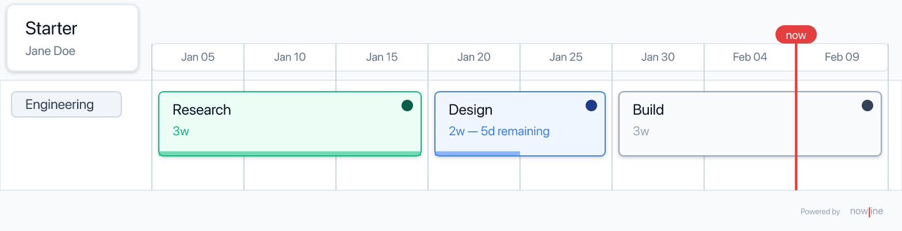

<p align="center">
  
</p>

<p align="center">
  <strong>A human-readable domain-specific language for roadmaps.</strong>
</p>

---

## What is Nowline?

Nowline is a text-first DSL for describing product and engineering roadmaps. You write plain `.nowline` files — indented, keyword-driven, diff-friendly — and tooling renders them as timelines, validates them, and composes them.

[`examples/minimal.nowline`](./examples/minimal.nowline):

```nowline
nowline v1

roadmap minimal "Starter" start:2026-01-05 scale:1w author:"Engineering roadmap"

swimlane engineering "Engineering"
  item research "Research"  duration:3w status:done
  item design   "Design"    duration:2w status:in-progress remaining:50%
  item build    "Build"     duration:3w status:planned
```

Renders to:

<p align="center">
  
</p>

## Why Nowline?

- **Text, not a Gantt chart.** Version-controlled, diffable, reviewable in a PR.
- **Indentation, not XML.** Roadmaps read like outlines, because that's how people think about them.
- **Strict enough to catch mistakes.** 30+ validation rules, clear error messages with line and column numbers.
- **Composable.** `include` other files with explicit `merge` / `ignore` / `isolate` semantics.

## Status

Nowline is pre-release. Nothing is published to package registries, Homebrew, or GitHub Releases yet — the toolchain runs from source. Stable releases will land with the milestones tracked in [`specs/milestones.md`](./specs/milestones.md). The parser, validator, layout, renderer, every export format (SVG, PNG, PDF, HTML, Markdown+Mermaid, XLSX, MS Project XML), and CLI (verbless render, `--dry-run`, `--init`, `--serve`) are usable today.

## Packages

This repository is an OSS monorepo of the Nowline language tooling.

### Core layers

| Package | Purpose |
|---|---|
| [`@nowline/core`](./packages/core) | Parser, typed AST, and validator. Pure TypeScript; no DOM, no Node-specific APIs in the hot path. |
| [`@nowline/layout`](./packages/layout) | Layout engine — AST → positioned model (themes, style resolution, calendar, timeline). |
| [`@nowline/renderer`](./packages/renderer) | SVG renderer — positioned model → deterministic SVG string. |

### Export packages

| Package | Purpose |
|---|---|
| [`@nowline/export-core`](./packages/export-core) | Shared types, unit converter, PDF page-size parser, 5-step font resolver, bundled DejaVu fonts. |
| [`@nowline/export-png`](./packages/export-png) | PNG via [`@resvg/resvg-js`](https://github.com/yisibl/resvg-js) WASM. |
| [`@nowline/export-pdf`](./packages/export-pdf) | Vector PDF via [`pdfkit`](https://github.com/foliojs/pdfkit) + `svg-to-pdfkit`. |
| [`@nowline/export-html`](./packages/export-html) | Self-contained HTML page with inline pan/zoom JS. |
| [`@nowline/export-mermaid`](./packages/export-mermaid) | Markdown + Mermaid `gantt` block. |
| [`@nowline/export-xlsx`](./packages/export-xlsx) | Five-sheet workbook via [`exceljs`](https://github.com/exceljs/exceljs). |
| [`@nowline/export-msproj`](./packages/export-msproj) | MS Project import XML. |

### CLI

| Package | Purpose |
|---|---|
| [`@nowline/cli`](./packages/cli) | `nowline` — every export format (SVG, PNG, PDF, HTML, Markdown+Mermaid, XLSX, MS Project XML) plus AST round-trip. ~70 MB standalone binary. |

Planned: a browser embed script and an LSP / VS Code extension.

## Design

Design specs for the DSL, renderer, CLI, IDE integrations, and OSS milestones live under [`specs/`](./specs). Start here if you want to understand how Nowline is shaped before touching code.

| Spec | Scope |
|------|-------|
| [`specs/principles.md`](./specs/principles.md) | What Nowline is and isn't — scope, guiding principles, design constraints |
| [`specs/architecture.md`](./specs/architecture.md) | Monorepo layout, package dependency graph, tech choices |
| [`specs/dsl.md`](./specs/dsl.md) | The `.nowline` language — full grammar reference |
| [`specs/cli.md`](./specs/cli.md) | CLI surface (verbless render; `--serve`, `--init`, `--dry-run` mode flags) |
| [`specs/rendering.md`](./specs/rendering.md) | Positioned model and SVG renderer |
| [`specs/ide.md`](./specs/ide.md) | LSP and editor integrations (VS Code, Obsidian, Neovim, JetBrains) |
| [`specs/embed.md`](./specs/embed.md) | Browser embed script and GitHub Action |
| [`specs/features.md`](./specs/features.md) | Scoring rubric + feature tables (m1–m4.5) |
| [`specs/milestones.md`](./specs/milestones.md) | OSS roadmap (m1–m4.5) |

## Try it from source

Until release artifacts ship, the fastest way to try `nowline` is to run it from a checkout:

```bash
git clone https://github.com/lolay/nowline.git
cd nowline
pnpm install
pnpm build
```

`pnpm build` walks every workspace package in dependency order and then renders the curated lists in [`scripts/render-samples.mjs`](./scripts/render-samples.mjs) (examples) and [`scripts/render-tests.mjs`](./scripts/render-tests.mjs) (fixtures) to sibling `.svg` files for inspection. Set `NOWLINE_SKIP_RENDER=1` to skip the render step.

To regenerate the SVGs run `pnpm samples` (writes `examples/*.svg`) or `pnpm fixtures` (writes `tests/*.svg`); both rebuild the workspace incrementally first so the output always reflects the current source, and both accept positional slugs (e.g. `pnpm samples minimal long`) for a single example. To skip the rebuild step, invoke the underlying scripts directly (`node scripts/render-samples.mjs [slug ...]`); they error out if the CLI bundle is older than its source. The SVGs themselves are gitignored — they are CLI output, not source.

That produces `packages/cli/dist/index.js` with a `#!/usr/bin/env node` shebang. Invoke it directly:

```bash
node packages/cli/dist/index.js examples/minimal.nowline           # writes ./minimal.svg
node packages/cli/dist/index.js examples/minimal.nowline --dry-run # validate only
node packages/cli/dist/index.js examples/minimal.nowline --serve   # live preview
node packages/cli/dist/index.js --init my-project                  # ./my-project.nowline
```

Or expose it on your `PATH` with a local `npm link`:

```bash
cd packages/cli
npm link          # adds `nowline` to your PATH
nowline examples/minimal.nowline
nowline --version
```

## Use the CLI

`nowline` is **verbless**: rendering is the default. Other operations are flags on the same command.

### Render (default)

```bash
nowline roadmap.nowline                          # writes ./roadmap.svg
nowline roadmap.nowline -f png                   # writes ./roadmap.png
nowline roadmap.nowline -f pdf                   # writes ./roadmap.pdf
nowline roadmap.nowline -f html                  # writes ./roadmap.html
nowline roadmap.nowline -f mermaid               # writes ./roadmap.md
nowline roadmap.nowline -f xlsx                  # writes ./roadmap.xlsx
nowline roadmap.nowline -f msproj                # writes ./roadmap.xml
nowline roadmap.nowline -o roadmap.pdf           # format inferred from extension
nowline roadmap.nowline -o -                     # SVG to stdout
nowline roadmap.nowline --theme dark --now 2026-03-15
nowline roadmap.nowline --now - --asset-root ./brand --no-links --strict
nowline roadmap.nowline -f pdf --page-size a4 --orientation landscape --margin 0.5in
cat roadmap.nowline | nowline -                  # stdin → ./roadmap.svg
```

The render pipeline is `@nowline/core` parse → `@nowline/layout` layout →
`@nowline/renderer` SVG → format-specific exporter. Output is byte-for-byte
deterministic for the same input, theme, and `--now`. A single `nowline`
binary ships every format — see
[`packages/cli/README.md`](./packages/cli/README.md#install) for install
details and [`specs/cli-distribution.md`](./specs/cli-distribution.md) for
why we ship one binary instead of a tiered split.

### Validate (`--dry-run`)

Run the full pipeline (parse + validate + layout + format) without writing. Exits `0` on success, `1` if any errors are emitted.

```bash
nowline roadmap.nowline --dry-run
nowline roadmap.nowline -n                          # short alias
cat roadmap.nowline | nowline - --dry-run           # read stdin
nowline roadmap.nowline -n --diagnostic-format json # machine-readable output
```

### Convert text ↔ JSON

Convert is just `-f json` (or `-f nowline` to go the other way). Input format is inferred from the extension; `--input-format` overrides for unusual filenames.

```bash
nowline roadmap.nowline -f json -o roadmap.json    # text → JSON
nowline roadmap.json -f nowline -o roadmap.nowline # JSON → text (canonical)
nowline roadmap.nowline -f json -o - | jq '.ast.roadmapDecl.name'
```

The emitted JSON carries a top-level `"$nowlineSchema": "1"` so downstream tools can detect schema changes. Comments are not preserved across round-trips — see [`packages/cli/README.md`](./packages/cli/README.md) for the canonical printer rules.

### Serve (`--serve`)

Run a live-reload preview in the browser. Great while authoring.

```bash
nowline roadmap.nowline --serve                    # http://127.0.0.1:4318
nowline roadmap.nowline --serve -p 4400 -t dark --open
nowline roadmap.nowline --serve -o latest.svg      # rewrite latest.svg on each rebuild
```

The server re-parses, re-validates, re-lays-out, and re-renders on every file change; connected clients refresh automatically via Server-Sent Events. Validation errors are displayed as an overlay on top of the most recent successful render.

### Init (`--init`)

Scaffold a new `.nowline` file in cwd. The positional argument is the **project name**, not a file path. `.nowline` is auto-appended.

```bash
nowline --init                              # ./roadmap.nowline (default name)
nowline --init my-project                   # ./my-project.nowline
nowline --init my-plan.nowline              # ./my-plan.nowline (literal)
nowline --init my-project --template=teams  # use the teams template
```

`minimal`, `teams`, and `product` correspond to the files under [`examples/`](./examples). Existing files are silently overwritten.

### Exit codes

| Code | Meaning |
|---|---|
| 0 | Success |
| 1 | Validation error (parse failure, invalid reference) |
| 2 | Usage error (missing input, bad flags, unsupported format, file not found, binary→TTY refusal) |
| 3 | Output error (cannot write to destination) |

## Use the library

`@nowline/core` is a pure-TypeScript parser + typed AST + validator built on [Langium](https://langium.org/). Everything the CLI does on top of parsing is itself built against this library.

```ts
import { createNowlineServices, resolveIncludes } from '@nowline/core';
import { URI } from 'langium';
import { readFile } from 'node:fs/promises';

const { shared, Nowline } = createNowlineServices();
const text = await readFile('roadmap.nowline', 'utf-8');
const doc = shared.workspace.LangiumDocumentFactory.fromString(
  text,
  URI.file('/absolute/path/to/roadmap.nowline'),
);
await shared.workspace.DocumentBuilder.build([doc], { validation: true });

const ast = doc.parseResult.value;
const diagnostics = doc.diagnostics ?? [];

const resolved = await resolveIncludes(ast, '/absolute/path/to/roadmap.nowline', {
  services: Nowline,
});

console.log(resolved.content);
```

## Language at a glance

### File structure

```nowline
nowline v1                        // 1. version directive (optional, must be first)

include "shared/teams.nowline"    // 2. includes
include "brand.nowline" config:isolate

config                            // 3. config section (optional)
scale
  name: weeks
style enterprise
  bg: blue
  fg: navy

roadmap r "My Roadmap"            // 4. roadmap section

swimlane platform
  item x "Work item" duration:1w status:done
```

### Entities

| Keyword | Purpose |
|---|---|
| `roadmap` | The top-level roadmap declaration. At most one per file. |
| `swimlane` | A horizontal lane of work. |
| `item` | A unit of work inside a swimlane. |
| `parallel` | A block whose children run concurrently. |
| `group` | A logical grouping of items, rendered together. |
| `anchor` | A named date on the timeline. |
| `milestone` | A point-in-time marker that depends on work. |
| `footnote` | A callout anchored to one or more entities. |
| `person`, `team` | Ownership references. |
| `style`, `label`, `status`, `duration`, `scale`, `calendar`, `default` | Config and declaration entries. |

### Properties

```nowline
item auth "Auth refactor"
  duration: 2w              // duration literal: d, w, m, q, y
  status: in-progress       // builtin or custom from config
  owner: sam                // id reference (person or team)
  after: kickoff            // dependency (single)
  after: [kickoff, approvals] // dependency (list)
  remaining: 30%             // percentage
  labels: [security, p0]     // list of label ids
  link: https://…            // URL (bare, no quotes)
```

### Roadmap start date

A `roadmap` may carry an optional `start:YYYY-MM-DD` that anchors the timeline baseline:

```nowline
roadmap platform-2026 "Platform 2026" start:2026-01-06
```

- If the roadmap contains any `anchor`, or any `milestone` with a `date:` property, `start:` is **required**.
- Every such date must be on or after `start:`.
- A pure-relative roadmap (built from `duration:` and `after:` only) does not need `start:`.
- Across `include`s that don't use `roadmap:ignore`, the parent and any included roadmap must agree on `start:` — both absent, or both present with the same value. Mismatches are errors, not silent overrides.

### Includes

```nowline
include "teams.nowline"                     // merge everything (default)
include "snippet.nowline"  config:ignore    // skip child config
include "partner.nowline"  roadmap:isolate  // render child as a separate region
```

- `merge` — default: child content is merged; parent definitions win on collision.
- `ignore` — child content of that kind is discarded.
- `isolate` — child roadmap is preserved as a self-contained region (requires a `roadmap` in the child).

## Syntax highlighting

A TextMate grammar is at [`grammars/nowline.tmLanguage.json`](./grammars/nowline.tmLanguage.json). Works in any editor that supports TextMate grammars (VS Code, Sublime Text, Zed, IntelliJ via third-party plugins, etc.). A first-class LSP and VS Code extension are planned.

## Examples

Progressively-richer examples are included:

- [`examples/minimal.nowline`](./examples/minimal.nowline) — smallest complete file.
- [`examples/capacity.nowline`](./examples/capacity.nowline) — lane and item `capacity:` with on-call support taking a quarter of team bandwidth; lane utilization underline.
- [`examples/sizing.nowline`](./examples/sizing.nowline) — T-shirt `size:` entries plus shortening calendar span with `capacity:` (parallel work).
- [`examples/teams.nowline`](./examples/teams.nowline) — persons, teams, anchors, milestones, footnotes.
- [`examples/product.nowline`](./examples/product.nowline) — full config, styles, labels, parallels, groups, descriptions.
- [`examples/long.nowline`](./examples/long.nowline) — stress test: eight swimlanes, ~160 items, parallels, groups, anchors, milestones, footnotes, cross-cutting labels. Used for layout/render perf.
- [`examples/nested.nowline`](./examples/nested.nowline) + [`examples/nested/`](./examples/nested) — parent Security swimlane plus five isolated per-team roadmap includes (iOS, Android, Web, Platform, Data). Demonstrates `roadmap:isolate`.

## Visual reference

Reference renderings the renderer aims to match live in [`specs/samples/`](./specs/samples). Open [`specs/samples/index.html`](./specs/samples/index.html) for a side-by-side gallery of the SVG outputs alongside their DSL snippets.

For renderer manual validation, see [`tests/`](./tests) — tiny `.nowline` fixtures that each stress a single layout / rendering axis (sized titles, text-fit-vs-spill, etc.). Their SVG output is gitignored and regenerated by every `pnpm build`.

## Contributing

Bug reports, feature requests, and pull requests are welcome. Start with [`CONTRIBUTING.md`](./CONTRIBUTING.md) for setup, build/test commands, and the expected workflow.

## License

Apache 2.0 — see [`LICENSE`](./LICENSE).
