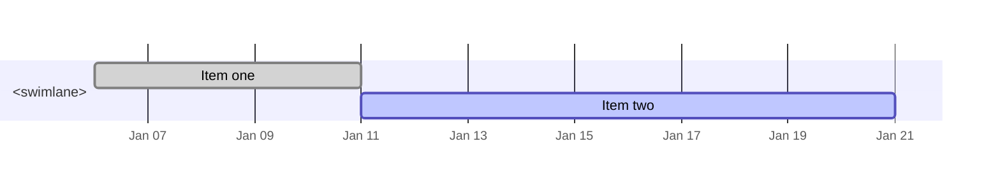

# @nowline/export-mermaid

Markdown + Mermaid `gantt` export. Transpiles a Nowline AST into a Markdown
page that renders in any Mermaid-aware viewer (GitHub, GitLab, Obsidian,
mermaid.live, etc.). Pure strings — no Node-only dependencies.

**License:** Apache 2.0
**Part of:** [`lolay/nowline`](../../) monorepo
**Spec:** [`specs/handoffs/m2c.md`](../../specs/handoffs/m2c.md) § 6
**Tiny / full:** *full only* — install
[`@nowline/cli-full`](../cli-full) or download `nowline-full-<os>-<arch>`
from [GitHub Releases](https://github.com/lolay/nowline/releases).

## Install

```bash
pnpm add @nowline/export-mermaid @nowline/export-core
```

## Usage

```ts
import { exportMermaid } from '@nowline/export-mermaid';

const md = exportMermaid(inputs, {
    lossyComment: true,           // default; emits the trailing `%%` comment
});

// `md` is a Markdown string. Write to disk as roadmap.md, or stdin → stdout.
```

CLI:

```bash
nowline roadmap.nowline -f mermaid -o roadmap.md
nowline roadmap.nowline -f md      -o -          # alias; stdout
nowline roadmap.nowline -o roadmap.md            # extension-inferred
```

`md` and `markdown` are CLI aliases for `mermaid`.

## Output shape

```markdown
# <Roadmap title>

<description paragraph if any>



%% Lossy export — Mermaid does not support: labels (3), footnotes (1)
```

The first line of the Markdown is the roadmap title. The fenced
```` ```mermaid ```` block contains a valid `gantt` diagram; the trailing
`%%` comment line lists Nowline features that don't have a Mermaid
equivalent and have been dropped.

## Lossy export policy

Mermaid `gantt` is intentionally a much simpler model than Nowline. The
following Nowline features are dropped (silently inside the gantt block,
named in the trailing `%%` comment):

- `label`, `style` declarations
- `footnote` annotations
- `description` directives on items
- Custom `status` definitions beyond Mermaid's `done` / `active` /
  `crit`
- Per-`person` / `team` ownership styling

Per spec Resolution 4, `--strict` does *not* escalate these drops to
errors. The export succeeds on any valid AST and the comment makes the
loss visible to the reader.

## Options

| Option         | Default | Notes |
|----------------|---------|-------|
| `lossyComment` | `true`  | Append the trailing `%%` comment listing dropped features. Set `false` to omit (e.g., for snapshots in environments where Mermaid is the canonical view). |

## Determinism

- No `new Date()`, no random.
- Item ordering follows AST order (already deterministic from
  `@nowline/core`).
- Snapshots in `test/__snapshots__/` regenerate via `vitest -u`.

## License

Apache-2.0.
