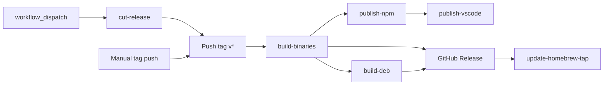

# Releasing Nowline

This document is for maintainers cutting a release. End users should look at [`README.md`](../README.md); contributors at [`CONTRIBUTING.md`](../CONTRIBUTING.md). The Homebrew tap layout is documented separately in [`specs/homebrew-tap.md`](./homebrew-tap.md).

All packages in this monorepo (the `@nowline/*` npm packages **and** the VS Code extension) share a single version and ship together. The release pipeline lives in [`.github/workflows/release.yml`](../.github/workflows/release.yml).

## Versioning scheme

We use [Semantic Versioning](https://semver.org/) — `MAJOR.MINOR.PATCH`, tagged `vMAJOR.MINOR.PATCH`. Every package in `packages/*` is kept lock-step at the same version.

- **`0.x.y`** — public API and AST JSON schema may change between **minor** versions; patch releases are bug-fix only. Call out breaking changes in the CHANGELOG.
- **`1.0.0` and after** — `MAJOR` is reserved for breaking changes to the DSL, AST schema, or CLI surface. Minors add features without breaking. Patches are bug-fixes.

The DSL itself uses an independent integer-only version (`nowline v1`, `v2`, …) declared inside `.nowline` files; that contract lives in [`specs/dsl.md`](./dsl.md) and is **not** tied to package SemVer.

### Dev-build version string

`packages/*/package.json#version` always reflects the *last released* version on `main`. To keep dev builds distinguishable from real releases without rewriting `package.json` between every commit, the CLI appends git build metadata to its `--version` output (per SemVer §10):

| Build | `nowline --version` |
|---|---|
| Tagged release (HEAD == `vX.Y.Z`) | `0.1.0` |
| Dev build, clean tree | `0.1.0+abc1234` |
| Dev build, uncommitted changes | `0.1.0+abc1234.dirty` |

The `+...` suffix is informational metadata only; npm and the VS Code Marketplace strip / reject it on their own version fields, so it never reaches a published artifact. The metadata is captured at compile time by `packages/cli/scripts/bundle-templates.mjs` (which shells out to `git rev-parse`, `git describe --exact-match`, and `git status --porcelain`).

## Pre-flight

Before cutting a release, on `main`:

1. **CI is green** on the latest `main` commit (Linux, macOS, Windows).
2. **`CHANGELOG.md` is up to date.** See [Changelog workflow](#changelog-workflow) below — contributors should already have appended entries to `## [Unreleased]` as part of their PRs; the maintainer moves them to a new `## [vX.Y.Z] - YYYY-MM-DD` section as part of the release-cut commit.
3. **Examples render cleanly.** `pnpm build` (which runs `pnpm samples` and `pnpm fixtures`) should produce the expected SVGs without warnings.
4. **Smoke-test the standalone binary locally** with `pnpm --filter @nowline/cli compile:local` and run `examples/minimal.nowline` through every export format. This catches `bun compile` regressions that the CI smoke test cannot reach for cross-platform binaries.
5. **First-time setup is complete.** The first-ever release additionally requires the `lolay/homebrew-tap` repo, Marketplace / Open VSX namespaces, and all five repo secrets to be in place. Walk through [`specs/release-bootstrap.md`](./release-bootstrap.md) once before tagging `v0.1.0`; subsequent releases can skip it.

## Cutting the release

There are two ways to trigger a release; the dispatch UI is the default.

### 1. Dispatch UI (primary)

1. Go to **Actions → Release → Run workflow** on `lolay/nowline`.
2. Pick the `level` (`patch` / `minor` / `major`).
3. Click **Run workflow**.

This kicks off the `cut-release` job, which:

1. Checks out `main` using `RELEASE_TAG_PAT` (a user-scoped PAT — `GITHUB_TOKEN`-pushed tags do not trigger downstream workflows, which would defeat the whole point).
2. Runs `node scripts/bump-version.mjs <level>` to rewrite every `packages/*/package.json` to the next SemVer.
3. Commits the bump as `release vX.Y.Z`.
4. Tags `vX.Y.Z`.
5. Pushes both the commit and the tag to `main`.

The tag push then re-triggers `release.yml` under `event_name == 'push'`, which runs the actual build/publish jobs (the `cut-release` job is gated to dispatch-only; the build/publish jobs are gated to tag-pushes-only).

### 2. Manual fallback

If the dispatch flow is unusable (e.g. PAT expired), you can do the same thing locally:

```bash
node scripts/bump-version.mjs patch     # or minor / major; prints new version
git commit -am "release vX.Y.Z"
git tag vX.Y.Z
git push origin main
git push origin vX.Y.Z
```

The tag push triggers the same downstream jobs.

## Pipeline



### `cut-release`

Dispatch-only. Bumps versions, commits, tags, and pushes. See [Cutting the release](#cutting-the-release).

### `build-binaries`

Builds standalone CLI binaries for six targets via `bun compile`:

- `bun-darwin-arm64`, `bun-darwin-x64`
- `bun-linux-x64`, `bun-linux-arm64`
- `bun-windows-x64`, `bun-windows-arm64`

Each binary runs a smoke test against `examples/minimal.nowline` covering every export format (SVG, PNG, PDF, HTML, Mermaid, XLSX, MS Project XML), except cross-target combinations that cannot execute on the runner. Binaries upload as artifacts named `nowline-<suffix>`.

### `build-deb`

Packages the Linux x64 and arm64 binaries into `.deb` archives via `scripts/build-deb.sh`. Output uploads as `nowline_<arch>.deb` artifacts.

### `publish-npm`

Publishes every workspace package to npm in dependency order:

1. `@nowline/core`
2. `@nowline/layout`
3. `@nowline/renderer`
4. `@nowline/export-core`
5. `@nowline/export-png`, `@nowline/export-pdf`, `@nowline/export-html`, `@nowline/export-mermaid`, `@nowline/export-xlsx`, `@nowline/export-msproj`
6. `@nowline/lsp`
7. `@nowline/cli`

Requires the `NPM_TOKEN` repository secret.

### `publish-vscode`

Builds a `.vsix` from `packages/vscode-extension` (`pnpm package`, which sources the bundled LSP and renderer from the workspace), then publishes it to:

- the **VS Code Marketplace** via `vsce publish` using `VSCE_PAT`, and
- **Open VSX** via `ovsx publish` using `OVSX_PAT`.

We deliberately ship every tag as a stable release — Marketplace pre-release channels require SemVer pre-release suffixes (e.g. `0.1.0-rc.1`) that we do not currently produce. Revisit at 1.0 if we want a "next" channel.

### `release` (GitHub Release)

Collects all binary and `.deb` artifacts into a GitHub Release for the tag, with auto-generated release notes. Files attached:

- `nowline-macos-arm64`, `nowline-macos-x64`
- `nowline-linux-x64`, `nowline-linux-arm64`
- `nowline-windows-x64.exe`, `nowline-windows-arm64.exe`
- `nowline_amd64.deb`, `nowline_arm64.deb`
- `nowline.1` (man page; referenced as a Homebrew resource).

### `update-homebrew-tap`

Pushes a refreshed `Formula/nowline.rb` to [`lolay/homebrew-tap`](https://github.com/lolay/homebrew-tap) (the brew tap shorthand `lolay/tap` resolves to that GitHub repo) using the `HOMEBREW_TAP_TOKEN` secret. The formula points at the just-published GitHub Release URLs and embeds SHA256s computed on the fly. The job fails loudly if any expected artifact is missing rather than emitting an all-zero SHA. See [`specs/homebrew-tap.md`](./homebrew-tap.md) for the formula structure and seed-repo bootstrap.

## Hotfix flow

When a released line needs a fix without dragging in newer work from `main`:

1. Cut a `release/vX.Y` branch from the tag you need to patch (`git switch -c release/v0.1 v0.1.0`) and push it.
2. Open a PR against that branch with the fix.
3. Apply the **`backport main`** label.
4. After CI passes, merge. `.github/workflows/backport.yml` (using `korthout/backport-action`) auto-opens a follow-up PR cherry-picking the squash-commit onto `main`. Reviewer validates CI on the backport PR and merges it. Auto-merge is intentionally off because cherry-picks can conflict with newer work on `main`.
5. Cut a new tag from `release/vX.Y` (`v0.1.1`) via the manual `Release` workflow dispatch (run it from the `release/v0.1` branch via the **Use workflow from** dropdown). The tag itself does not need to live on `main`; the published binaries / packages just need the right code at the right SHA.

## Required secrets

All secrets live under **Settings → Secrets and variables → Actions** on `lolay/nowline`.

| Secret | Used by | Purpose |
|---|---|---|
| `RELEASE_TAG_PAT` | `cut-release` | User-scoped PAT (fine-grained, `contents: write` on `lolay/nowline`) used to push the release commit + tag. `GITHUB_TOKEN`-pushed tags do not trigger downstream workflow runs, which would prevent the build/publish jobs from firing. |
| `NPM_TOKEN` | `publish-npm` | npm publish for `@nowline/*` packages. Use an automation token. |
| `VSCE_PAT` | `publish-vscode` | Azure DevOps personal access token with **Marketplace → Manage** scope, scoped to the `nowline` publisher. |
| `OVSX_PAT` | `publish-vscode` | Open VSX personal access token. |
| `HOMEBREW_TAP_TOKEN` | `update-homebrew-tap` | Fine-grained PAT with `contents: write` on `lolay/homebrew-tap` for committing the refreshed formula. |

## Changelog workflow

`CHANGELOG.md` follows [Keep a Changelog](https://keepachangelog.com). Two roles, one file:

- **Contributors** append an entry to the `## [Unreleased]` section as part of their PR. Use the existing subsections (`Added`, `Changed`, `Deprecated`, `Removed`, `Fixed`, `Security`) and link to the PR number where useful.
- **Maintainers**, as the first step of cutting a release, move every entry under `## [Unreleased]` into a new `## [vX.Y.Z] - YYYY-MM-DD` section directly above it, leaving an empty `## [Unreleased]` skeleton for the next cycle. This becomes part of the `release vX.Y.Z` commit produced by the `cut-release` job — for now this is a manual edit before triggering the dispatch.

> **Future enhancement.** A pre-flight check could fail the dispatch if `## [Unreleased]` is empty (or if its body has not been moved into a `vX.Y.Z` section in the working tree). Useful guard once we ship more frequently; not yet implemented.

## After release

- Verify the GitHub Release page lists all eight binaries / debs.
- Verify each `@nowline/*` package shows the new version on npm (`npm view @nowline/cli version`).
- Verify Homebrew works: `brew update && brew install lolay/tap/nowline && nowline --version` — should print `X.Y.Z` (no `+sha` suffix on a release build).
- Verify the VS Code extension shows the new version on the Marketplace and Open VSX.

## Rollback

There's no automated rollback. If a release is broken:

1. Open a GitHub issue describing what's wrong.
2. Cut a hotfix release with the next patch version (e.g. `v0.1.0 → v0.1.1`) via the [Hotfix flow](#hotfix-flow); do **not** delete or overwrite the broken tag.
3. Mark the broken release as a pre-release on GitHub so package managers stop offering it.
4. For npm-specific breakage, `npm deprecate '@nowline/<pkg>@<version>' "broken release; use vX.Y.Z+1"` rather than unpublishing — unpublish has a 72-hour window and breaks existing lockfiles.
5. For Marketplace breakage, you can unpublish a version with `vsce unpublish nowline.vscode@X.Y.Z`. Open VSX has a similar `ovsx unpublish` command.
