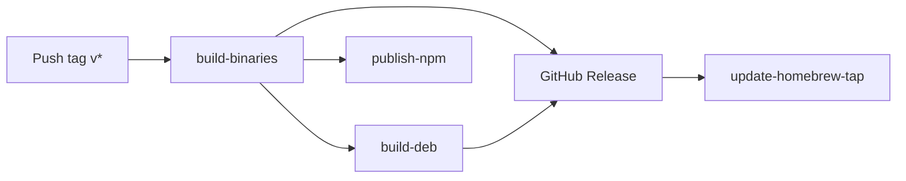

# Releasing Nowline

This document is for maintainers cutting a release. End users should look at [`README.md`](../README.md); contributors at [`CONTRIBUTING.md`](../CONTRIBUTING.md).

All packages in this monorepo share a single version and ship together. The release pipeline lives in [`.github/workflows/release.yml`](../.github/workflows/release.yml) and is triggered by pushing a tag that matches `v*`.

## Pre-flight

Before tagging, on `main`:

1. **CI is green** on the latest `main` commit (Linux, macOS, Windows).
2. **Versions match across packages.** Every `packages/*/package.json` shares the same `version`. There is no Changesets / Lerna automation; bump them in a single commit.
3. **`CHANGELOG.md` is up to date.** Move entries from `## [Unreleased]` into a new `## [vN] - YYYY-MM-DD` section. Keep the `## [Unreleased]` heading with empty subsections.
4. **Examples render cleanly.** `pnpm build` (which runs `pnpm samples` and `pnpm fixtures`) should produce the expected SVGs without warnings.
5. **Smoke-test the standalone binary locally** with `pnpm --filter @nowline/cli compile:local` and run `examples/minimal.nowline` through every export format. This catches `bun compile` regressions that the CI smoke test cannot reach for cross-platform binaries.

## Cutting the release

```bash
# Bump every packages/*/package.json to the new version, e.g. v1.
# Update CHANGELOG.md.
git commit -am "release v1"
git tag v1
git push origin main --tags
```

Pushing the tag triggers `release.yml`. The workflow runs four jobs:



### `build-binaries`

Builds standalone CLI binaries for six targets via `bun compile`:

- `bun-darwin-arm64`, `bun-darwin-x64`
- `bun-linux-x64`, `bun-linux-arm64`
- `bun-windows-x64`, `bun-windows-arm64`

Each binary runs a smoke test against `examples/minimal.nowline` covering every export format (SVG, PNG, PDF, HTML, Mermaid, XLSX, MS Project XML), except cross-target combinations that cannot execute on the runner. Binaries upload as artifacts named `nowline-<suffix>`.

### `build-deb`

Packages the Linux x64 and arm64 binaries into `.deb` archives via `scripts/build-deb.sh`. Output uploads as `nowline_<arch>.deb` artifacts.

### `publish-npm`

Publishes every workspace package to npm in dependency order:

1. `@nowline/core`
2. `@nowline/layout`
3. `@nowline/renderer`
4. `@nowline/export-core`
5. `@nowline/export-png`, `@nowline/export-pdf`, `@nowline/export-html`, `@nowline/export-mermaid`, `@nowline/export-xlsx`, `@nowline/export-msproj`
6. `@nowline/cli`

Requires the `NPM_TOKEN` repository secret. `@nowline/lsp` and the VS Code extension are not currently published from this workflow — they ship from satellite repos (`lolay/nowline-vscode`).

### `release` (GitHub Release)

Collects all binary and `.deb` artifacts into a GitHub Release for the tag, with auto-generated release notes. Files attached:

- `nowline-macos-arm64`, `nowline-macos-x64`
- `nowline-linux-x64`, `nowline-linux-arm64`
- `nowline-windows-x64.exe`, `nowline-windows-arm64.exe`
- `nowline_amd64.deb`, `nowline_arm64.deb`

### `update-homebrew-tap`

Pushes a refreshed `Formula/nowline.rb` to [`lolay/tap`](https://github.com/lolay/tap) using the `HOMEBREW_TAP_TOKEN` secret. The formula points at the just-published GitHub Release URLs and embeds SHA256s computed on the fly.

## Required secrets

| Secret | Used by | Purpose |
|---|---|---|
| `NPM_TOKEN` | `publish-npm` | npm publish for `@nowline/*` packages. Use an automation token. |
| `HOMEBREW_TAP_TOKEN` | `update-homebrew-tap` | Personal access token with write access to `lolay/tap` for committing the updated formula. |

Both must be configured under **Settings → Secrets and variables → Actions** on `lolay/nowline`.

## Versioning scheme

Pre-1.0: tags are `v0.x.y` and may break the AST JSON schema between any two releases — call out breaking changes in the CHANGELOG.

1.0 onward: tags are `v1`, `v2`, `v3`. Hotfixes get a dotted suffix (`v2.1`). Major-version bumps are reserved for breaking DSL or AST schema changes; hotfixes carry only fixes. Package versions inside the monorepo always match the tag.

## After release

- Verify the GitHub Release page lists all eight binaries / debs.
- Verify each `@nowline/*` package shows the new version on npm (`npm view @nowline/cli version`).
- Verify Homebrew works: `brew update && brew install lolay/tap/nowline && nowline --version`.
- Open a new `## [Unreleased]` section in `CHANGELOG.md` if you didn't already, and push a follow-up commit on `main`.

## Rollback

There's no automated rollback. If a release is broken:

1. Open a GitHub issue describing what's wrong.
2. Cut a hotfix release with the next version bump (e.g. `v2 → v2.1`); do **not** delete or overwrite the broken tag.
3. Mark the broken release as a pre-release on GitHub so package managers stop offering it.
4. For npm-specific breakage, `npm deprecate '@nowline/<pkg>@<version>' "broken release; use vN+1"` rather than unpublishing — unpublish has a 72-hour window and breaks existing lockfiles.
