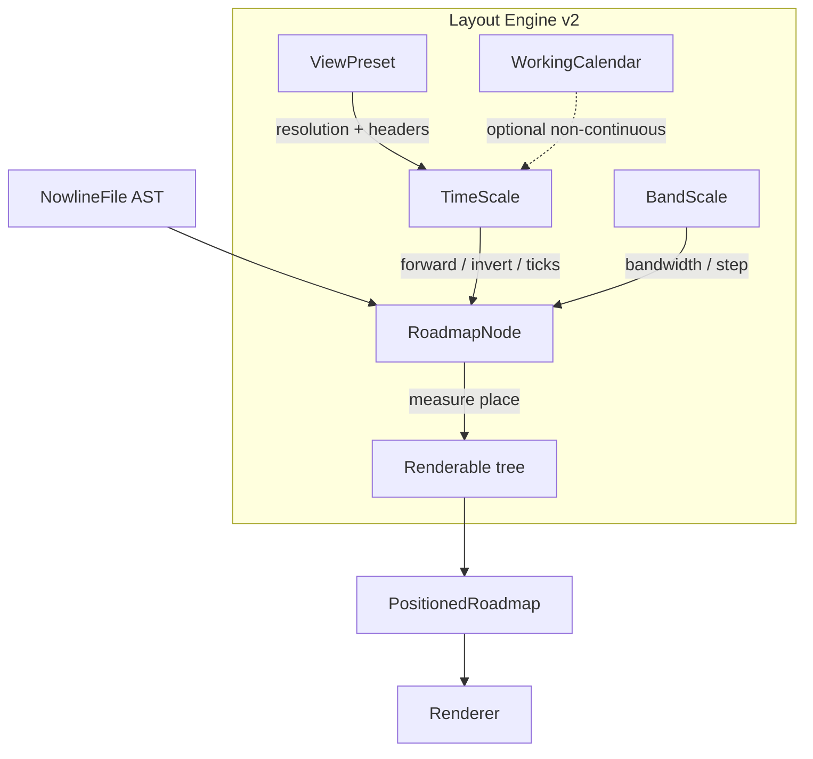

# Nowline — Rendering Engine v2 Specification

## Overview

This spec defines the **internal architecture** of the next-generation `@nowline/layout` engine and the small carve-out from `@nowline/renderer` that lets the engine swap cleanly. It is the source of truth for milestones m2.5a through m2.5d, which sit between [m2h](./milestones.md#m2h--sample-isolate-include) and [m3](./milestones.md#m3--embed) in the milestone chain.

The **public output** — what the renderer emits, what the embed script ships, what the GitHub Action commits — is unchanged. See [`rendering.md`](./rendering.md) for the output contract; this document covers what runs underneath.

The architecture was validated end-to-end against `examples/minimal.nowline` in a standalone `layout-v2/` prototype during planning. The prototype was retired once the production port (m2.5a–c) landed; see commit `771127c` for the removal.

### What v2 is

- A refactor of [`packages/layout/`](../packages/layout) replacing imperative tick math, hardcoded row heights, and a monolithic `layoutRoadmap` function with five orthogonal primitives.
- A small carve-out from [`packages/renderer/`](../packages/renderer) so resolved palette tokens live in the positioned model instead of behind `theme === 'dark'` branches in the renderer.
- A *byte-stable* swap on every existing sample: `minimal`, `platform-2026`, `platform-2026-dark`, `dependencies`, `isolate-include` all re-render identically (or with explicit, documented diffs) at every phase boundary.

### What v2 is not

- Not a DSL change. The grammar, parser, validation rules, and `@nowline/core`'s typed AST are unchanged.
- Not a re-skin. The light and dark palettes, font stacks, sample fidelity, and entity geometries are preserved.
- Not an interactive editor. v2 unlocks `TimeScale.invert()` for m4's editor work, but does not ship editing surfaces itself.
- Not an edge-routing rewrite. The current orthogonal router from `layout.ts` carries forward unchanged through m2.5c; ELK / dagre integration is a separate future milestone.
- Not a style-cascade rewrite. [`style-resolution.ts`](../packages/layout/src/style-resolution.ts) keeps its current shape; v2 nodes consume already-resolved styles.

## Why before m3

[m3](./milestones.md#m3--embed) ships the **first publicly distributed artifacts** that bundle `@nowline/layout` and `@nowline/renderer`: the browser embed script (CDN-distributed) and the GitHub Action (commits SVG/PNG into user repos). Both make engine internals externally visible in two ways:

1. **Bundle size.** Every embed script consumer downloads the engine on every page load. The current layout core (`layout.ts` 1.6 KLOC + `timeline.ts` + `calendar.ts` + `style-resolution.ts` + `types.ts` + themes ≈ 3,057 lines) and renderer (1,271 lines) are both materially larger than the v2 architecture target.

2. **Output stability.** The Action commits SVGs to repository history. Engine swaps after public release create visual diff noise across versions and lock us into a backwards-compat constraint with every embed-script user.

Doing m2.5 before m3 means the public release establishes its byte-stable baseline on the leaner engine, not on a foundation we already plan to replace.

## Architectural Primitives

Five primitives, each with a single responsibility:



### TimeScale

Wraps `d3-scale.scaleTime`. Maps dates to x-coordinates and back, with optional non-continuous compression via a `WorkingCalendar`.

```ts
interface TimeScale {
    forward(date: Date): number;
    invert(x: number): Date;
    ticks(unit: TimeUnit, increment?: number): Date[];
    domain(): [Date, Date];
    range(): [number, number];
}
```

Replaces `buildTimelineScale` + `pixelsPerDay` + `xForDate` from [`timeline.ts`](../packages/layout/src/timeline.ts). Adds `invert()` for the m4 editor's click-to-date and `ticks()` for label generation.

### BandScale

Wraps `d3-scale.scaleBand`. Maps swimlane IDs to y-coordinates with `bandwidth()` (one row's height) and `step()` (row + gap).

```ts
interface BandScale {
    forward(id: string): number;
    bandwidth(): number;
    step(): number;
    paddingInner(value?: number): number | this;
}
```

Replaces the hardcoded `ITEM_ROW_HEIGHT = 64` constant. `paddingInner` finally surfaces `defaults > spacing` to the DSL author.

### ViewPreset

Declarative time-header configuration. Replaces the imperative `LABEL_THINNING` table and per-unit format functions.

```ts
interface ViewPreset {
    name: string;
    resolution: { unit: TimeUnit; increment: number };
    headers: HeaderRow[];
    pixelsPerTick: number;
}

interface HeaderRow {
    unit: TimeUnit;
    increment?: number;
    thinEvery?: number;
    format: (date: Date, previous: Date | undefined) => string;
}
```

Multi-row headers (year over month over day) drop out for free. Adding a new preset is one declarative entry, not a code branch.

### WorkingCalendar

Strategy interface for non-continuous time (skip weekends, holidays, custom shutdowns). Slots into `TimeScale` as one optional constructor argument; no other module needs to know it exists.

```ts
interface WorkingCalendar {
    isWorkingTime(date: Date): boolean;
    workingDaysBetween(from: Date, to: Date): number;
    dateAtWorkingIndex(from: Date, n: number): Date;
}

// Built-in factories
continuousCalendar();
weekendsOff();
withHolidays(base, isoDates);
```

Lands alongside the existing `CalendarConfig` in [`calendar.ts`](../packages/layout/src/calendar.ts). The DSL's `business` calendar mode becomes a factory call (`weekendsOff()`).

### Renderable

Measure/place tree, one node type per entity. Each node implements two methods:

```ts
interface Renderable<TInput, TPositioned> {
    measure(ctx: MeasureContext): IntrinsicSize;
    place(origin: Point, ctx: PlaceContext): TPositioned;
}
```

Replaces the monolithic `layoutRoadmap` function in [`layout.ts`](../packages/layout/src/layout.ts). One file per entity (`ItemNode`, `SwimlaneNode`, `GroupNode`, `ParallelNode`, `AnchorNode`, `MilestoneNode`, `FootnoteNode`, `IncludeNode`). Adding a new entity type means adding a new node file with no edits to existing ones.

X stays time-driven through `TimeScale`. Y becomes content-driven: each node computes its intrinsic height from text-size + padding + content, and parents stack.

## Conversion Phases

The four phases ship as separate milestones, ordered low-risk to high-risk so each can be merged and validated independently. The dependency chain is strict — phase order matches risk order matches integration order.

### m2.5a — Layout v2: Time Axis

**Scope.** Replace [`packages/layout/src/timeline.ts`](../packages/layout/src/timeline.ts) (204 L) with `TimeScale` + `ViewPreset`. Land `WorkingCalendar` in [`calendar.ts`](../packages/layout/src/calendar.ts) alongside the existing `CalendarConfig`.

**Files changed:**

- `packages/layout/src/timeline.ts` — replaced by `time-scale.ts` + `view-preset.ts`
- `packages/layout/src/calendar.ts` — extended with `WorkingCalendar` strategies
- `packages/layout/src/layout.ts` — call sites swap from `buildTimelineScale(...)` to `new TimeScale({ ... })`; positioned-model output identical
- `packages/layout/package.json` — adds `d3-scale` and `d3-time` dependencies (~10 KB tree-shaken)

**Validation criteria:**

- Every existing CLI render test stays byte-stable on the default continuous calendar.
- New test: `weekendsOff()` shrinks `pixelsPerDay` (working-day density compresses against working-day domain).
- New test: `forward(d) → invert(x) → forward(d')` round-trips on continuous calendars (`d === d'`).
- New test: `weekPreset` over an 8-week span produces 8 ticks; `monthPreset` over a 5-month span produces a year row + month row.

**Out of scope:**

- Item / swimlane / group geometry (m2.5b, m2.5c).
- Theme tokens (m2.5d).
- DSL changes for new calendar modes (DSL keeps `calendar:business`; the new factory just powers it).

**Risk and mitigation.** Low. `PositionedTimelineScale` shape stays stable so the renderer needs no changes. Mitigation: ship the new tick generator behind the same call site; keep the old `timeline.ts` until the new path is fully byte-stable, then delete.

### m2.5b — Layout v2: Band Heights

**Scope.** Wire `BandScale` into swimlane row sizing. Replace the hardcoded `ITEM_ROW_HEIGHT` constant and connect the currently-ignored `defaults > spacing` parsing path to actual band layout.

**Files changed:**

- `packages/layout/src/layout.ts` — swimlane stacking block consumes `new BandScale({ ... })`
- `packages/layout/src/themes/shared.ts` — `ITEM_ROW_HEIGHT` deleted; `bandwidth()` is the new source of truth
- `packages/layout/src/style-resolution.ts` — `defaults > spacing` resolved value flows into `BandScale.paddingInner`

**Validation criteria:**

- Bumping `defaults > spacing` from `none` to `md` widens the visible gap between bands by the expected pixel delta.
- Bumping item `text-size` from `md` to `lg` grows the bar height (currently ignored).
- Existing samples re-render byte-stable when `defaults > spacing` is unset (default `none`).

**Out of scope:**

- Per-entity content-driven measurement (that's m2.5c — items still use the v1 height calc until the tree lands).
- New DSL knobs.

**Risk and mitigation.** Low. Touches one localized block in `layout.ts`. Mitigation: regression-test each existing sample to confirm byte-stable output when `spacing` keeps its default; document any non-default-spacing behavior diffs as bugfixes.

### m2.5c — Layout v2: Measure/Place Tree

**Scope.** The load-bearing rewrite. Replace the bulk of [`layout.ts`](../packages/layout/src/layout.ts) (~1.6 KLOC) with a tree of `Renderable` nodes, one file per entity type.

**Files changed:**

- `packages/layout/src/layout.ts` — collapses to the composition root (~300 L); per-entity logic moves to nodes
- New: `packages/layout/src/nodes/item-node.ts`
- New: `packages/layout/src/nodes/swimlane-node.ts`
- New: `packages/layout/src/nodes/group-node.ts`
- New: `packages/layout/src/nodes/parallel-node.ts`
- New: `packages/layout/src/nodes/anchor-node.ts`
- New: `packages/layout/src/nodes/milestone-node.ts`
- New: `packages/layout/src/nodes/footnote-node.ts`
- New: `packages/layout/src/nodes/include-node.ts`
- New: `packages/layout/src/nodes/roadmap-node.ts` (composition root)

**Validation criteria:**

- Every existing sample (`minimal`, `platform-2026`, `platform-2026-dark`, `dependencies`, `isolate-include`) re-renders byte-stable.
- All existing CLI render tests pass.
- Adding a hypothetical new entity type (e.g. `LegendNode`) means a new node file with no edits to existing ones.
- Each node's `measure()` returns deterministic intrinsic size given a resolved style and time scale.

**Out of scope:**

- Style cascade rewrite. `style-resolution.ts` stays as-is; nodes consume `ResolvedStyle` as input.
- Edge routing rewrite. The orthogonal router from `layout.ts` extracts to `packages/layout/src/edge-router.ts` unchanged; nodes provide endpoint geometry only.
- ELK / dagre integration.
- AST integration changes — still consumes `@nowline/core`'s typed AST through the same call site.

**Risk and mitigation.** High — this is the rewrite that proves the architecture. Mitigation:

1. Port one entity type at a time, starting with `ItemNode` and `SwimlaneNode` (validated end-to-end in the prototype during planning).
2. Keep the old code path live until each entity's tests pass on the new path.
3. Use byte-stable sample regression as the gate at every PR — visual drift is a rejection criterion.
4. Defer any "while we're here" simplifications; m2.5c is a faithful port, not a redesign.

### m2.5d — Layout v2: Theme in Model

**Scope.** Resolved palette tokens move into the positioned model so the renderer becomes pure data → SVG.

**Files changed:**

- `packages/layout/src/types.ts` — `Positioned*` types gain resolved-color fields (`fill`, `stroke`, `text`)
- `packages/layout/src/themes/light.ts`, `dark.ts` — palette resolution feeds into the positioned-model construction
- `packages/renderer/src/svg/render.ts` — every `theme === 'dark' ? ...` branch removed

**Validation criteria:**

- `--theme dark` still emits the expected palette on every sample.
- The renderer file shrinks measurably (target: 20%+ reduction; not load-bearing if real number is lower).
- No `theme ===` branch remains in `packages/renderer/`.
- Embed bundle size measurably smaller.

**Out of scope:**

- New themes or palette changes.
- Custom-theme DSL surface (separate future work).

**Risk and mitigation.** Medium — touches both packages but the change is mechanical: every renderer-side palette lookup becomes a positioned-model field read. Mitigation: byte-stable regression on light + dark output for every sample.

## Backwards Compatibility

The `PositionedRoadmap` interface stays stable across all four phases. New fields are added (m2.5d adds resolved colors), but no existing field is removed or renamed. Consequence:

- `@nowline/cli` consumers see no API change.
- `@nowline/embed` (m3) consumes the same model regardless of which engine produced it.
- The XLSX / PDF / PNG / Markdown adapters from m2c continue to work unchanged.
- The `ResolveResult` → positioned model boundary is the migration surface, not the renderer.

The only **internal** API changes are inside `packages/layout/src/` (private to the package).

## Reference Implementation

The architecture was first validated in a standalone `layout-v2/` TypeScript prototype that ran `examples/minimal.nowline` end-to-end without touching the production packages. It validated all five primitives, exercised the measure/place tree on `Item` and `Swimlane`, and produced byte-stable output against the minimal sample.

The prototype's scope was intentionally limited to the `minimal.nowline` slice — `Item`, `Swimlane`, time header, now-line — so the architectural primitives could be validated in isolation. The m2.5a–c port proved they survive the full DSL surface (groups, parallels, anchors, milestones, footnotes, includes); the prototype was then retired (commit `771127c`).

The production code mirrors the prototype's layout module-for-module:

| Production module | Prototype analog | Notes |
|---|---|---|
| `packages/layout/src/time-scale.ts` | `layout-v2/src/scales.ts` | d3-scale wrapper |
| `packages/layout/src/working-calendar.ts` | `layout-v2/src/working-calendar.ts` | Strategy interface |
| `packages/layout/src/view-preset.ts` | `layout-v2/src/view-preset.ts` | Header tick generation |
| `packages/layout/src/nodes/*.ts` | `layout-v2/src/renderable.ts` | One file per entity |
| `packages/layout/src/nodes/roadmap-node.ts` | `layout-v2/src/build.ts` | Composition root |
| `packages/layout/src/types.ts` | `layout-v2/src/positioned.ts` | Positioned model |

## Open Questions

These are deferred to the relevant phase's design pass and should not block planning:

- **Style resolution surfacing in `Renderable.measure`.** Today `style-resolution.ts` resolves a style upfront; v2 nodes accept `ResolvedStyle` as input. Whether `measure()` ever needs *unresolved* style input (for late-binding text-size from container context, for example) is a m2.5c open question.
- **Edge routing eventually moving into the tree.** m2.5c keeps the existing router. If a future milestone moves orthogonal routing into the measure/place tree (e.g. via an `EdgeNode` that participates in collision detection), this spec gets a follow-up.
- **`d3-scale` / `d3-time` bundle impact in the embed.** Estimated ~10 KB tree-shaken, but actual measurement happens in m2.5a's PR and informs whether m3's embed bundle stays under its target ceiling.
- **`logo:` rendering inside `Renderable`.** The header is currently a special case; m2.5c decides whether the logo lives inside `RoadmapHeaderNode` or stays a renderer-side concern.

## References

- [`specs/rendering.md`](./rendering.md) — public output contract (unchanged by this work)
- [`specs/milestones.md`](./milestones.md) — milestone summary and dependency chain
- [`specs/architecture.md`](./architecture.md) — package boundaries (unchanged)
- [`packages/layout/src/nodes/`](../packages/layout/src/nodes/) — production measure/place tree
