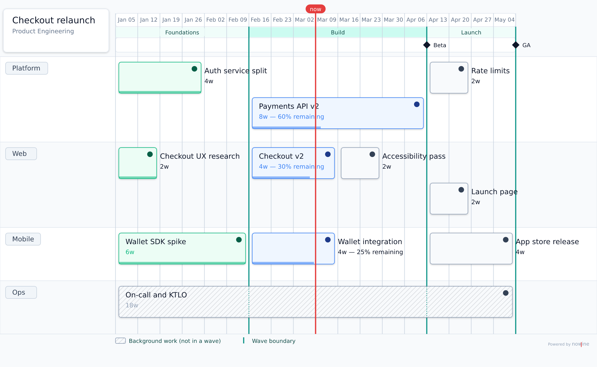

# Waves (design sample)

> **Accepted; implementation in progress as milestone m2o.** The diagram below is a design mockup, not renderer output. The spec is [`../waves.md`](../waves.md).

A **wave** is a batch of work across every team that opens together. No work in the next wave starts until the last work in this one ends. Teams that finish early wait at the boundary; that idle time is the honest cost of keeping everyone in step. Work that should not wait (on-call, KTLO, ongoing support) simply has no wave and is drawn hatched.

## The sample



The sample source is [`samples/checkout-relaunch.nowline`](./samples/checkout-relaunch.nowline), and the vector mockup is [`samples/checkout-relaunch.svg`](./samples/checkout-relaunch.svg).

The important lines from the source:

```nowline
wave foundations "Foundations"
wave build "Build"
wave launch "Launch"

swimlane web "Web"
  item ux-research "Checkout UX research" duration:2w wave:foundations status:done
  group wave:build
    item checkout-v2 "Checkout v2" duration:4w status:in-progress remaining:30%
    item a11y "Accessibility pass" duration:2w
  item launch-page "Launch page" duration:2w wave:launch

swimlane ops "Ops"
  item on-call "On-call and KTLO" duration:18w

milestone beta "Beta" after:build
milestone ga "GA" after:launch
```

The schedule the barrier produces:

| Wave | Weeks | Dates | Held by |
|---|---|---|---|
| Foundations | W0–W6 | Jan 5 – Feb 16 | Wallet SDK spike (6w) |
| Build | W6–W14 | Feb 16 – Apr 13 | Payments API v2 (8w) |
| Launch | W14–W18 | Apr 13 – May 11 | App store release (4w) |

### What to look at

- **The strip under the dates** names each wave, and the **teal lines** mark its edges.
- **Waiting is drawn honestly.** Web and Platform finish Foundations early, but Build still starts for everyone on Feb 16.
- **Grouping.** The Web lane's two Build items share one `group wave:build`, which draws nothing itself.
- **Background work** (On-call) is hatched, and the boundary lines run across it as dashed marks.
- **Milestones at wave ends.** Beta and GA sit exactly on boundaries: `milestone … after:build` means "when Build is done".

## Questions for testers

Ask these before explaining anything:

1. Without being told, what do you think the teal lines and the strip under the dates mean?
2. Can you tell which bars belong to a wave and which are background work? Is the hatching obvious enough to catch a bar someone forgot to assign?
3. Does it read as "nobody starts Build until all of Foundations is done"? Is the idle time before Feb 16 a useful signal or noise?
4. Is "wave" the right word for you? Would you have expected "phase", "stage", or something else?
5. Writing it: would you put `wave:build` on each item, wrap items in `group wave:build`, or want something else?
6. Do the Beta and GA diamonds on the boundaries read as "when the wave is done"?

## Files

- [`waves.md`](../waves.md) is the spec: name and prior art, semantics, validation rules, includes, layout, rendering, exporters, and 21 worked examples, including the messy ones.
- [`handoff-m2o-waves.md`](../handoffs/handoff-m2o-waves.md) is the implementation plan for milestone m2o: the milestone text, a decision log, a codebase map, and a phased plan with tests.
- [`samples/`](./samples/) holds the sample roadmap and the mockup. [`handoff-m2o-waves.md`](../handoffs/handoff-m2o-waves.md) §4.8 explains how the mockup was made.
